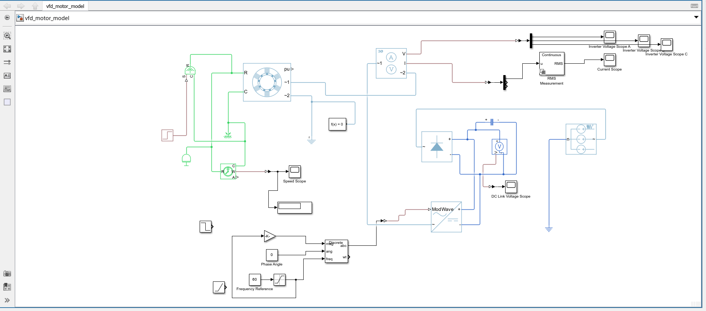
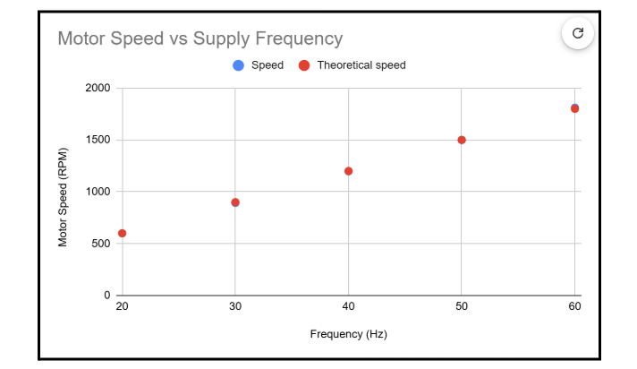
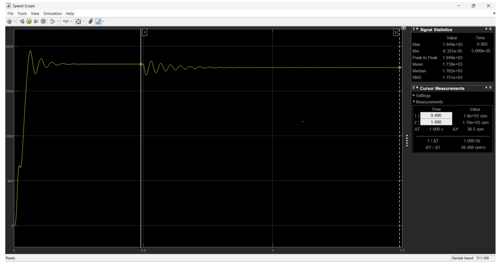
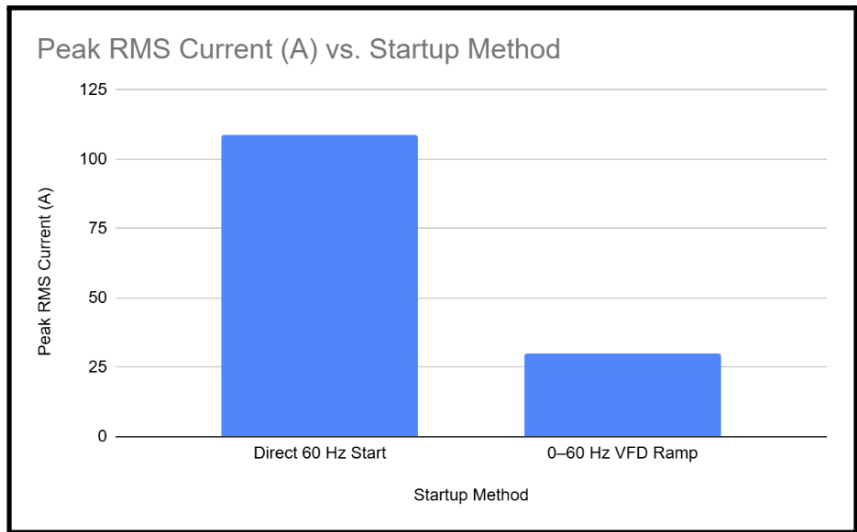
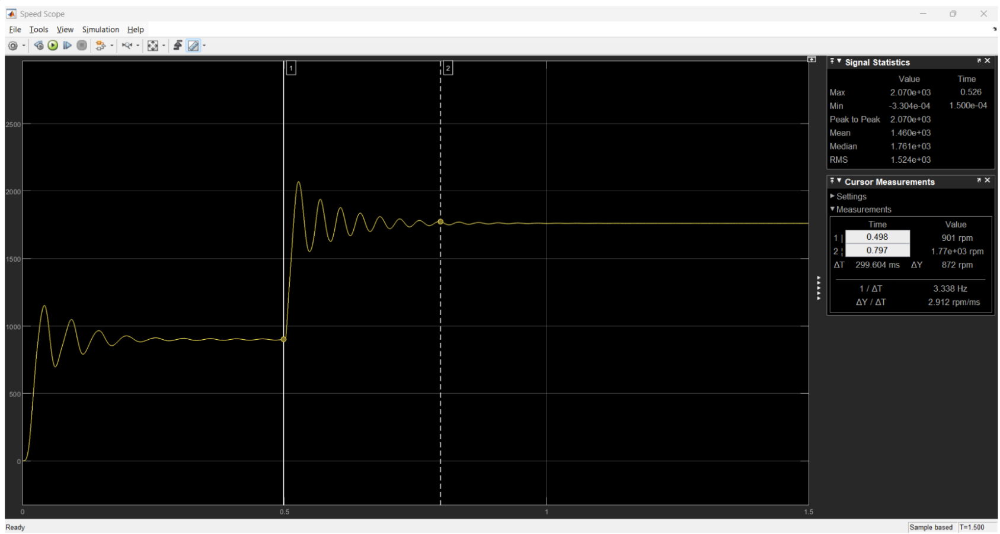

# VFD-Controlled Induction Motor Simulation

## Overview

This project models and analyzes a three-phase induction motor controlled by a variable frequency drive (VFD) using MATLAB, Simulink, and Simscape Electrical.

The system uses open-loop V/f control, where the motor supply frequency is varied while the inverter voltage command is scaled proportionally. The project focuses on motor speed control, load response, startup behavior, current demand, and transient performance.



## System Architecture

The model uses the following power flow:

Three-Phase AC Source  
→ Three-Phase Rectifier  
→ DC-Link Capacitor  
→ Average-Value Voltage Source Converter  
→ Three-Phase Induction Motor

The control path is:

Frequency Reference  
→ V/f Gain  
→ Three-Phase Modulation Signal  
→ Average-Value Converter

The model also includes measurement blocks for:

- motor speed
- RMS phase current
- inverter output voltage
- DC-link voltage
- mechanical load response

## Motor Configuration

| Parameter | Value |
|---|---:|
| Rated voltage | 220 V line-to-line RMS |
| Rated frequency | 60 Hz |
| Number of poles | 4 |
| Pole pairs | 2 |
| Synchronous speed at 60 Hz | 1800 RPM |
| Motor connection | Wye |

The synchronous speed is calculated using:

\[
N_s = \frac{120f}{P}
\]

where:

- \(N_s\) = synchronous speed in RPM
- \(f\) = electrical frequency in Hz
- \(P\) = number of poles

For a 4-pole motor:

\[
N_s = 30f
\]

## V/f Control

The open-loop V/f controller scales the modulation magnitude proportionally with frequency.

The control law used in the model is:

\[
m = 0.015f
\]

where:

- \(m\) = modulation magnitude
- \(f\) = commanded frequency in Hz

| Frequency | Modulation Magnitude |
|---:|---:|
| 20 Hz | 0.30 |
| 30 Hz | 0.45 |
| 40 Hz | 0.60 |
| 50 Hz | 0.75 |
| 60 Hz | 0.90 |

This proportional relationship allows the motor voltage command to increase with frequency while maintaining approximately constant V/f operation.

## Frequency Sweep Results

The motor was tested from 20 Hz to 60 Hz.

| Frequency | Theoretical Synchronous Speed | Simulated Speed |
|---:|---:|---:|
| 20 Hz | 600 RPM | 599.8 RPM |
| 30 Hz | 900 RPM | 893 RPM |
| 40 Hz | 1200 RPM | 1198 RPM |
| 50 Hz | 1500 RPM | 1499 RPM |
| 60 Hz | 1800 RPM | 1811 RPM mean |



The simulated motor speed closely followed the theoretical synchronous-speed relationship across the tested frequency range.

The largest measured deviation was less than 1%.

## Mechanical Load Response

A mechanical load step from 0 N·m to -20 N·m was applied at 60 Hz.

| Measurement | Result |
|---|---:|
| Load step | 0 to -20 N·m |
| Step time | 0.5 s |
| Speed before load | ~1820 RPM |
| Final speed | ~1740 RPM |
| RMS current before load | 27.26 A |
| RMS current after load | 32.58 A |

The RMS current increased by:

\[
32.58 - 27.26 = 5.32A
\]

This corresponds to an increase of approximately:

\[
19.5\%
\]

The motor speed decreased by approximately:

\[
80RPM
\]

or about:

\[
4.4\%
\]



The results show that increasing mechanical load causes the motor to slow while drawing more current to produce additional torque.

## Startup Comparison

Two startup methods were compared:

1. Immediate 60 Hz command
2. 0 to 60 Hz VFD frequency ramp

| Measurement | Direct 60 Hz Start | 0–60 Hz Ramp |
|---|---:|---:|
| Peak RMS current | 108.6 A | 30.08 A |
| Time to ~1620 RPM | ~0.07 s | ~0.916 s |
| Peak speed | 1953 RPM | 1767 RPM |
| Speed overshoot | ~8.5% | Minimal |
| Final speed | ~1800 RPM | ~1760 RPM |



The VFD ramp reduced the peak RMS startup current by:

\[
\frac{108.6 - 30.08}{108.6}\times100
\]

\[
\approx72.3\%
\]

The direct startup accelerated the motor much faster but produced a significantly larger current spike and greater speed overshoot.

The ramped startup produced slower acceleration but reduced electrical stress and provided a smoother response.

## Frequency Step Response

A frequency command was changed from 30 Hz to 60 Hz at 0.5 s.

| Measurement | Result |
|---|---:|
| Initial frequency | 30 Hz |
| Final frequency | 60 Hz |
| Frequency step time | 0.5 s |
| Speed before change | ~901 RPM |
| Peak speed | ~2070 RPM |
| Final settled speed | ~1760–1770 RPM |
| Approximate settling time | ~0.30 s |
| RMS current before step | ~7.27 A |
| Peak RMS current | ~93.23 A |
| Final RMS current | ~15.13 A |



The sudden frequency increase caused the motor to accelerate rapidly toward the higher operating-speed region.

The transient response produced both speed overshoot and a large temporary increase in RMS current before the system settled.

## Key Findings

- Motor speed closely followed the commanded supply frequency.
- The frequency sweep matched the theoretical synchronous-speed relationship closely.
- Open-loop V/f control provided effective basic speed control.
- Increasing mechanical load reduced motor speed and increased RMS current.
- A ramped VFD startup reduced peak RMS current by approximately 72.3%.
- Sudden frequency changes produced significant current spikes and transient speed overshoot.
- The averaged converter model made it possible to study system-level motor behavior without simulating individual semiconductor switching events.

## Modeling Approach

This project uses an Average-Value Voltage Source Converter rather than a detailed switching PWM inverter.

This approach represents the inverter using averaged output behavior instead of individual IGBT switching pulses.

The model is therefore intended for:

- motor speed-control analysis
- V/f control analysis
- load-response testing
- startup comparison
- system-level transient analysis

It is not intended for detailed analysis of:

- PWM switching harmonics
- semiconductor switching losses
- high-frequency current ripple
- individual inverter gate signals

A possible future extension would be to replace the average-value converter with a detailed PWM switching inverter and compare harmonic content, current ripple, and simulation performance.

## Software

- MATLAB
- Simulink
- Simscape
- Simscape Electrical

## Project Files

```text
VFD-Induction-Motor/
│
├── model/
│   └── vfd_induction_motor.slx
│
├── results/
│   ├── final_simulink_model.png
│   ├── speed_vs_frequency.png
│   ├── load_response.png
│   ├── startup_current_comparison.png
│   └── frequency_step_response.png
│
├── report/
│   └── VFD_Project_Report.pdf
│
└── README.md
